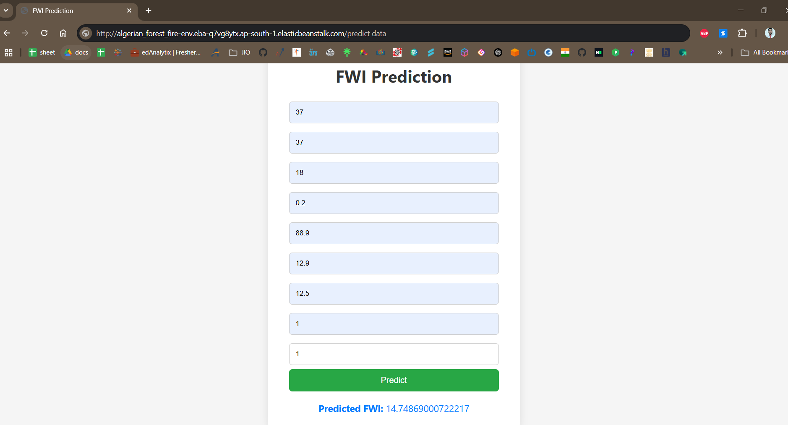

# 🔥 Algerian Forest Fire Prediction

This is a Flask-based web application that predicts the likelihood of a forest fire based on weather conditions. The model is trained on the Algerian Forest Fire Dataset (2012) covering Bejaia and Sidi Bel-Abbes regions.

## 🚀 Features

- Web form input for weather attributes
- Machine Learning-based prediction (Fire / No Fire)
- CI/CD with AWS CodePipeline
- Deployed on AWS Elastic Beanstalk

## 🛠️ Tech Stack

- Python • Flask • Scikit-learn  
- AWS Elastic Beanstalk • CodePipeline • HTML/CSS

## 📸 Screenshot

  
*A sample prediction result from the application.*

## 🧪 Run Locally

```bash
git clone https://github.com/pulkitagar25/Algerian_Forest_Fire.git
cd Algerian_Forest_Fire
pip install -r requirements.txt
python application.py
